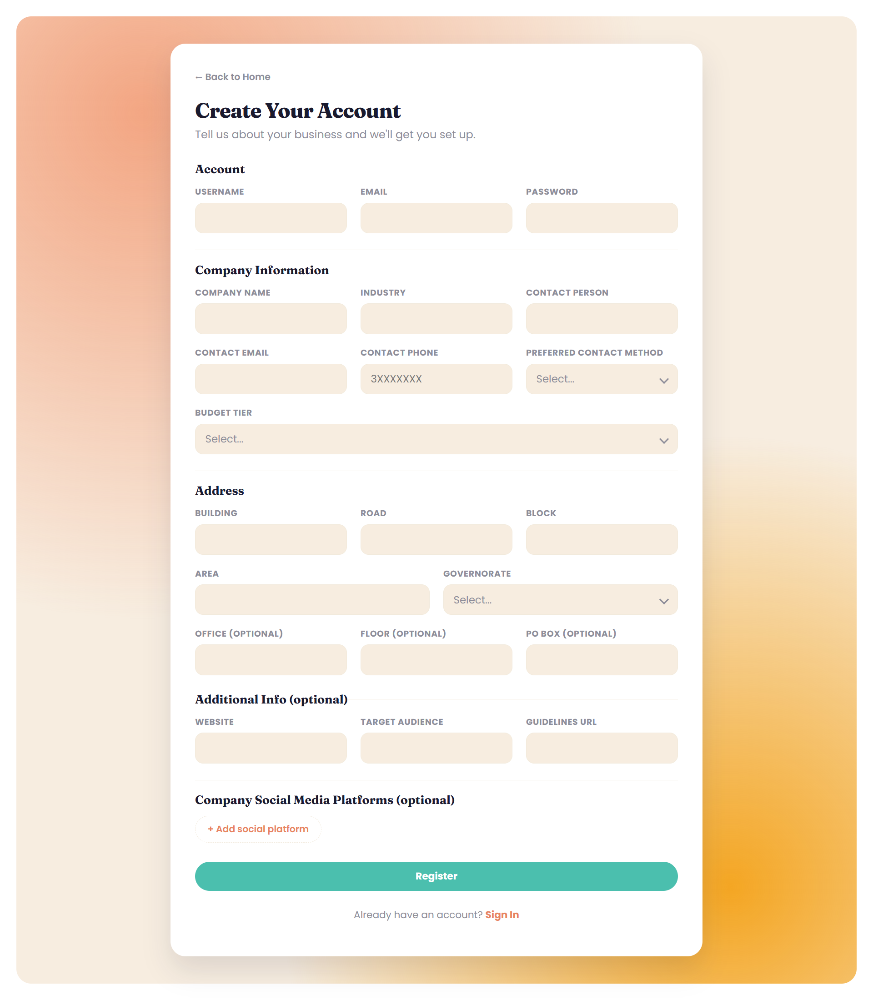
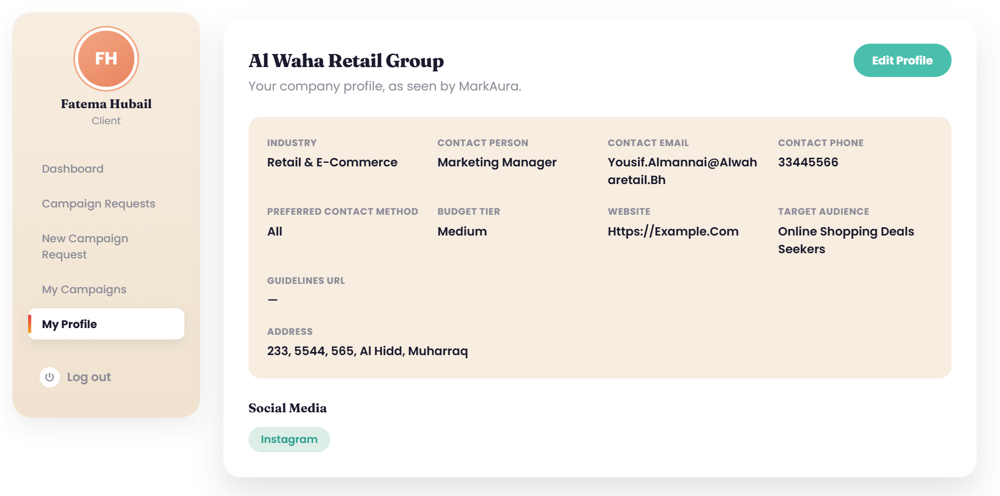
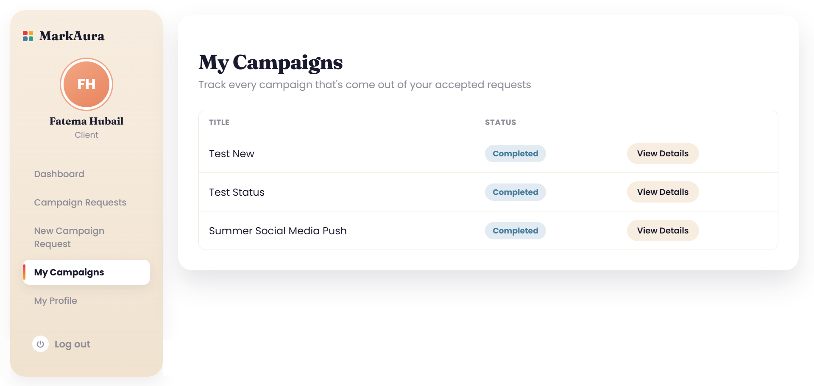
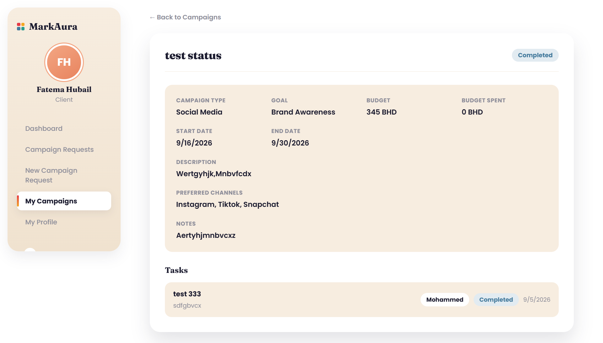

  

<h1 align="center">MarkAura</h1>

  A role-based marketing agency management platfMarkAura_ERD form from campaign request, to execution, to delivery.

## Description

MarkAura is a marketing agency management platform that manages the full lifecycle of a campaign from a client's initial request, through planning and execution by agency staff, to coordination with outsourced partners. Instead of managing this back-and-forth over emails and spreadsheets, MarkAura gives each party (clients, agency staff, and outsource partners) a role-based view of exactly what they need to act on next: clients submit and track campaign requests, staff review requests and manage active campaigns, and outsource agencies handle delegated tasks, all through a single, status-driven workflow.

This repository contains the **Node.js/Express API** for MarkAura. The client is a separate React application; see [`marketing-agency-frontend`](https://github.com/FatimaHubail/marketing-agency-frontend).

## Deployment

| Service | Platform | Link |
|---|---|---|
| Client (React) | [Vercel](https://vercel.com) | [marketing-agency-frontend-sandy.vercel.app](https://marketing-agency-frontend-sandy.vercel.app/) |
| API (this repo) | [Render](https://render.com) | <!-- add the live Render URL here --> |
| Database | [MongoDB Atlas](https://www.mongodb.com/atlas) | — |

## User Stories

### Client
**Account & Profile**
- As a client, I want to register and sign in to the platform, so that I can access my company's campaign data securely.
- As a client, I want to view and update my company profile, so that my contact and industry information stays accurate.

   
  Registration form

   
  Client dashboard after signing in

   
  Company profile page

**Submitting Campaign Requests**
- As a client, I want to submit a new campaign request with my goals, budget, and preferred channels, so that the agency has everything it needs to start planning.
- As a client, I want to edit my request while it's still awaiting review, so that I can correct or refine details before staff starts working on it.
- As a client, I want to delete a request I submitted, so that I'm not committed to a campaign I no longer need if it hasn't been accepted yet.

   
  New campaign request form

**Tracking Requests**
- As a client, I want to see a list of all my submitted requests and their statuses, so that I know where each one stands without contacting the agency directly.
- As a client, I want to view the details of a specific request, so that I can review exactly what I submitted.

   
  My Campaign Requests table

   
  Campaign request detail page

**Tracking Campaigns**
- As a client, I want to view a list of my campaigns and their status (pending, in progress, or completed), so that I can stay informed on progress without needing a status meeting.
- As a client, I want to view the details of a specific campaign, including its budget, timeline, and preferred channels, so that I have the full picture in one place.
- As a client, I want to see the tasks currently being worked on for my campaign, so that I know what's actively being done.

   
  My Campaigns table

   
  Campaign detail page with tasks

**Boundaries**
- As a client, I want my data isolated from other clients, so that I never see requests or campaigns that aren't mine.
- As a client, I should not be able to change a request's or campaign's status myself, so that only agency staff can validate and move work through the pipeline.

### Agency staff
1.  As an agency staff member, I want to view the dashboard so I can see current activities.

2.  As an agency staff member, I want to review client request so I can decide how to handle them.

3. As an agency staff member, I want to manage campaigns so I can track their progress.

4.  As an agency staff member, I want to create and assign tasks so work is organized. 

5.  As an agency staff member, I want to assign work to external partners so they can complete specific tasks.

6. As an agency staff member, I want to review submitted work so I can approve it or request revisions. 

7. As an agency staff member, I want to view client information so I can manage their campaigns.

8. As an agency staff member, I want to track campaign progress so I know what is completed and what is pending.

9. As an agency staff member, I want to create, view, edit and delete requests, campaigns, tasks and clients information.

### Admin
1. As an admin, I want to sign in securely, so that I can manage the platform's staff and outsource accounts.
2. As an admin, I want to create a staff account with a specialty, so that they can be assigned campaign work in their area of expertise.
3. As an admin, I want to create an outsource agency account with its service types, so that staff can delegate matching work to them.
4. As an admin, I want to view a list of all staff and outsource accounts, so that I have a full picture of who's on the platform.
5. As an admin, I want to view a single user's account and profile details, so that I can check or troubleshoot their information.
6. As an admin, I want to edit a staff or outsource account's details (including specialty or service types), so that I can correct or update their information as roles change.
7. As an admin, I want to delete a staff or outsource account, so that I can remove access once someone is no longer with the agency or partner.

### Outsource agency
1. As an outsource agency, I want to sign up with my details (name, email, service type, password), so that I can create an account and start receiving task requests. 
2. As an outsource agency, I want to sign in securely, so that I can access my assigned tasks and account. 
3. As an outsource agency, I want to sign out of my account.
4. As an outsource agency, I want to see a list of task requests sent to me, so that I know what work is being proposed to me.
5. As an outsource agency, I want to view the campaign title, campaign description, and campaign deadline for a task request, so that I understand the broader context before deciding.
6. As an outsource agency, I want to view the task title, task description, task deadline, and payment amount, so that I can evaluate whether the task fits my capacity and rates before accepting or rejecting.
7. As an outsource agency, I want to accept a task request, so that I can begin working on it and it moves into my active task list.
8. As an outsource agency, I want to reject a task request and provide a reason, so that the agency understands why I declined and can reassign it appropriately.
9. As an outsource agency, I want to update the status of a task I've accepted (not started, in progress, finished, delivered), so that the agency can track my progress in real time.
10. As an outsource agency, I want to pull a report of my previous tasks (including status, payment, and completion dates), so that I can track my work history and reconcile payments.

## Wireframes
Check out the wireframes sketching out layout and flow of the app covering the screens for clients, agency staff, and outsource partners across the request → campaign → task lifecycle.

### Client WireFrames

[Open Client wireframes in Excalidraw](https://excalidraw.com/#json=KVGBpR8L5VHBhtwp1NIRh,dwFCxrO4mXFGhTGH8-csUg) 

### Admin WireFrames

[Open Admin wireframes in Excalidraw](https://excalidraw.com/#json=SvL2zNvDnvWWTRajoaFbH,xYZN4i9fEsJA0UWlOk3d0w) 

### Agent Staff WireFrames

[Open Agency Staff wireframes in Excalidraw](https://excalidraw.com/#json=V0PU0amix4BDnANgbY0Re,NuTEOwe1H88DcIIhvqFDLg)

### Outsource Partners Wireframes

## ERD

## Technologies Used

**Client**
- React 19
- React Router 8
- Vite
- ESLint
- Plain CSS (custom design system, no CSS framework)

**API (this repo)**
- Node.js
- Express 5
- MongoDB with Mongoose
- JSON Web Tokens (`jsonwebtoken`) for authentication
- `bcrypt` for password hashing
- `cors`, `morgan`, `dotenv`, `validator`

**Tooling & Deployment**
- Git & GitHub (feature branches + pull requests)
- Vercel (client hosting)
- Render (API hosting)
- MongoDB Atlas (database hosting)

## Routing Tables

## Auth routes

| Method | Route | Access | Success | Errors | Notes |
|---|---|---|---|---|---|
| POST | `/auth/register` | public (client signup, incl. company fields) | `201 Created` | `400` invalid input · `409` username/email exists | Creates a `User` + `Client` profile in one call, this is the Register screen's "Create account" submit |
| POST | `/auth/sign-in` | public | `200 OK` | `400` missing fields · `401` bad credentials | Returns a JWT; the client decodes it and stores it in `localStorage`, there is no separate session-restore or logout route, "signing out" just clears the stored token |

## Client routes

| Method | Route | Access | Success | Errors | Notes |
|---|---|---|---|---|---|
| GET | `/clients/:id` | client | `200 OK` | `401` unauthenticated · `404` no client profile | Populates the Company Profile page |
| PUT | `/clients/:id` | client | `200 OK` | `400` validation · `401` unauthenticated | "Save changes" on the Company Profile page |
| POST | `/requests` | client | `201 Created` | `400` validation (e.g. invalid goal for type) | "Submit" on the New Campaign Request form |
| GET | `/requests` | client (own only) | `200 OK` | `401` unauthenticated | Populates the My Requests table |
| GET | `/requests/:id` | client (owner) | `200 OK` | `403` not owner · `404` not found | Backs the request detail page |
| PUT | `/requests/:id` | client (owner, `"submitted"` only) | `200 OK` | `400` validation · `403` not owner or already reviewed · `404` not found | Editing a request before staff starts reviewing it |
| DELETE | `/requests/:id` | client (owner, `"submitted"` only) | `204 No Content` | `403` not owner or already reviewed · `404` not found | The delete button on the My Requests page, only while still pending |
| GET | `/campaigns` | client (own only) · staff/admin (all) · outsource (own only) | `200 OK` | `401` unauthenticated | Populates the My Campaigns page |
| GET | `/campaigns/:id` | client (owner) · staff/admin (any) · outsource (own only) | `200 OK` | `403` not authorized · `404` not found | Populates the Campaign Detail page |
| GET | `/tasks/campaign/:campaignId` | client (owner) · staff/admin (any) · outsource (own only) | `200 OK` | `403` not authorized · `404` not found | Lists every task assigned to that campaign, shown on the Campaign Detail page |

### Agency staff routes
| Method | Path | Purpose |
|--------|------|---------|
| GET | `/campaign-requests` | Get campaign requests |
| GET | `/campaign-requests/:id` | Get one request |
| PUT | `/campaign-requests/:id` | Update request / accept / reject |
| DELETE | `/campaign-requests/:id` | Delete request |
| GET | `/tasks` | Get tasks |
| POST | `/tasks` | Create task |
| PUT | `/tasks/:id` | Update task |
| DELETE | `/tasks/:id` | Delete task |
| GET | `/clients` | Get clients |
| GET | `/clients/:id` | Get one client |
| PUT | `/clients/:id` | Update client |
| DELETE | `/clients/:id` | Delete client |

### Admin routes

| Method | Route | Access | Success | Errors | Notes |
|---|---|---|---|---|---|
| POST | `/admin/users` | admin | `201 Created` | `400` invalid role · `409` username exists | Creates a `staff` or `outsource` account (plus its `Staff`/`Outsource` profile) from the Admin User Management page |
| GET | `/admin/users` | admin | `200 OK` | `401` unauthenticated | Populates the Admin User Management table; each `staff`/`outsource` user is enriched with their specialty/service types |
| GET | `/admin/users/:id` | admin | `200 OK` | `404` not found | Returns a single user plus their `Staff`/`Outsource` profile, if any |
| PUT | `/admin/users/:id` | admin | `200 OK` | `400` invalid role · `404` not found | Edits a user's account fields and, for staff/outsource, their profile fields |
| DELETE | `/admin/users/:id` | admin | `200 OK` | `404` not found | Deletes the user and their `Staff`/`Outsource` profile, if any |

### Outsource partners routes
| Method | Route | Access | Success | Errors | Notes |
|--------|-------|--------|---------|--------|-------|
| GET | `outsource/:id` | outsource | `200 OK` | `401` unauthenticated · `404` no outsource profile | Populates the outsource partner's own profile page |
| PUT | `outsource/:id` | outsource | `200 OK` | `400` validation · `401` unauthenticated | "Save changes" on the outsource profile page |
| GET | `outsource/requests` | outsource (own only) | `200 OK` | `401` unauthenticated | Populates the incoming outsource-requests list — requests sent by a Campaign Manager awaiting accept/reject |
| GET | `outsource/requests/:id` | outsource (assigned only) | `200 OK` | `403` not assigned · `404` not found | Backs the request detail view before deciding to accept/reject |
| PUT | `outsource/requests/:id/accept` | outsource (assigned, `pending` only) | `200 OK` | `403` not assigned · `404` not found · `409` already decided | "Accept" button — flips the request to accepted and unlocks the related task(s) |
| PUT | `outsource/requests/:id/reject` | outsource (assigned, `pending` only) | `200 OK` | `400` reason required · `403` not assigned · `404` not found · `409` already decided | "Reject" button — requires a reason, which is relayed back to the Campaign Manager |
| GET | `outsource/tasks` | outsource (own only) | `200 OK` | `401` unauthenticated | Populates the outsource partner's task list — only tasks assigned to them, never other partners' work |
| GET | `outsource/tasks/:id` | outsource (assigned only) | `200 OK` | `403` not assigned · `404` not found | Backs the task detail view; campaign is populated with limited fields only (e.g. `title`, `deadline`) — never full campaign details |
| PUT | `outsource/tasks/:id/status` | outsource (assigned only) | `200 OK` | `400` invalid status transition · `403` not assigned · `404` not found | Moves the task through its status enum (e.g. `in_progress` → `submitted` → `revisions_requested` → `completed`) |

## Future Features

- A client-facing campaign review/approval step (approve, request changes, leave feedback) before a campaign goes live
- Staff departments with manager to assign tasks to staff/outsource
- In-app notifications when a request is accepted/rejected, a task is assigned, or a campaign is completed
- File/asset uploads on campaign requests and tasks (briefs, deliverables)
- Search and filtering across requests, campaigns, and tasks on the staff dashboard

## Attributions

Built during General Assembly's Software Engineering bootcamp
